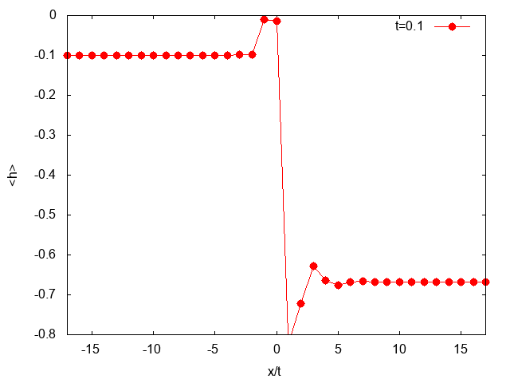
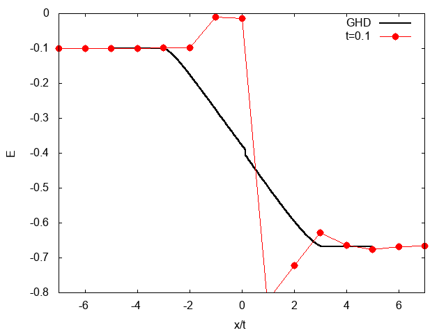

# Folded XXZ

`Folded_XXZ` is a C++ tensor-network simulation of a folded spin-1/2 XXZ
chain with three-site interactions. It uses [ITensor](https://itensor.org/)
to prepare a thermally biased state through imaginary-time evolution, then
evolve it in real time with Trotter gates.

This code accompanies the scientific work published in
[SciPost Physics 10, 099 (2021)](https://scipost.org/SciPostPhys.10.5.099).

The program is a single simulation executable built from separate physics and
runtime libraries.

## Example Results

Energy-profile evolution:



Rescaled energy-profile evolution:



## Requirements

- A C++ compiler compatible with the installed ITensor version.
- A built ITensor for C++ v3 installation.
- CMake 3.21 or later.

ITensor C++ v3 is built with Makefiles and does not provide a CMake package.
This project locates its headers and static library through the
`ITENSOR_ROOT` CMake cache variable. The ITensor build must be completed before
configuring this project.

## Build

Configure an out-of-source build, passing the root of the built ITensor source
tree:

```bash
cmake -S . -B build \
  -DITENSOR_ROOT="$HOME/Programming/itensor" \
  -DCMAKE_BUILD_TYPE=Release

cmake --build build
```

The resulting executable is `build/3siteHam`. CMake finds the required BLAS,
LAPACK, and threading libraries used by ITensor.

To configure, build, check formatting, run tests, and launch the simulation in
one command, use:

```bash
./scripts/run.sh N 40 T 20 tau 0.01 TL 100 TR 5
```

Override the default ITensor location or build directory when needed:

```bash
ITENSOR_ROOT=/path/to/itensor BUILD_DIR=/path/to/build ./scripts/run.sh
```

## Tests

Build and run the CTest suite with:

```bash
ctest --test-dir build --output-on-failure
```

The current test suite verifies core observables against a deterministic
all-up product state.

## Run

Parameters are supplied as whitespace-separated `name value` pairs. All
values are numeric; unknown parameter names terminate the program after it
prints the supported parameter set.

```bash
./build/3siteHam N 40 T 20 tau 0.01 TL 100 TR 5 EnergyProf 0.1 Sz 0.1
```

`N` is the number of sites in the original physical chain. Internally the
program uses `2 * N` spin sites: odd indices are physical sites and even
indices are their ancillas. The initial MPS pairs each physical site with its
ancilla in a singlet-like state.

The default run has `N = 10` and `T = 0`, so it prepares the initial thermal
state but does not perform positive-time real-time evolution.

## Parameters

| Parameter | Default | Meaning |
| --- | ---: | --- |
| `N` | `10` | Physical-chain length; the MPS has `2*N` sites. |
| `J` | `1.0` | Interaction scale. |
| `tau` | `0.01` | Real-time Trotter step. |
| `T` | `0` | Final real time. |
| `dbeta` | `0.01` | Imaginary-time (inverse-temperature) step. |
| `TL`, `TR` | `100`, `5` | Left and right temperatures used for state preparation. |
| `hL`, `hR` | `0`, `0` | Left/right staggered-field amplitudes during thermal preparation. |
| `max_bond` | `4000` | Maximum MPS bond dimension. |
| `trunc` | `1e-10` | Real-time truncation cutoff. |
| `trunc0` | `1e-10` | Imaginary-time truncation cutoff. |
| `Entropy` | `0` | Enable center-bond entropy output when nonzero. |
| `SVD_spec` | `0` | Interval for center-bond singular-value output; requires `Entropy`. |
| `Eprof` | `0` | Interval for full entanglement-entropy profiles. |
| `Energy_beta` | `1` | Enable energy versus inverse-temperature output when positive. |
| `EnergyProf` | `0` | Interval for energy and `Q1minus` profiles after preparation. |
| `Q2Prof` | `0` | Enable `Q2` profile output after preparation. |
| `Sz` | `0` | Interval for magnetization profiles after preparation. |

`TrotterOrder` selects a first- or second-order Trotter decomposition; the default is `2`.
For time-resolved profile options, the interval must be a positive integer multiple of `tau`.

## Outputs

Enabled observables are written to the current working directory. Existing
files with these names are overwritten.

| File | Controlled by |
| --- | --- |
| `Entropy_center.dat` | `Entropy` |
| `SVD_spec.dat` | `SVD_spec` (and `Entropy`) |
| `Energy_beta.dat` | `Energy_beta` |
| `Entropy_profile.dat` | `Eprof` |
| `Energy_profile.dat` | `EnergyProf` |
| `Q1minus_profile.dat` | `EnergyProf` |
| `Q2_profile.dat` | `Q2Prof` |
| `Sz_profile.dat` | `Sz` |
| `Sz_average_profile.dat` | `Sz` |

Profile files separate successive time slices with blank lines, making them
convenient to plot with tools such as gnuplot.

## Code map

- `src/main.cc`: executable entry point.
- `src/simulation.cc`: command-line parsing and configuration construction.
- `src/simulation_runner.cc`: simulation lifecycle, including state
  preparation, evolution, and output scheduling.
- `src/initial_state.cc`, `src/three_site_hamiltonian.cc`,
  `src/trotter_evolution.cc`, and `src/observables.cc`: physics layer.
- `include/folded_xxz/model_config.h`: typed model inputs shared by the
  Hamiltonian and Trotter evolution.
- `src/parameters.cc`, `src/simulation_config.cc`, and
  `include/folded_xxz/simulation_schedule.h`: runtime configuration and
  command-line parameter handling.
- `src/output.cc`: `ObservableWriter`, which owns output files and observable
  serialization.
- `CMakeLists.txt`: CMake build definition and ITensor integration.
- `Pictures/`: example energy-profile animations.

## Notes

The model and observable conventions are encoded directly in the source. In
particular, the Hamiltonian acts on odd (physical) sites of the folded MPS;
the even sites are ancillas used for purification. Consult the Hamiltonian
construction in `src/three_site_hamiltonian.cc` before comparing normalization or signs with a
different XXZ convention.
